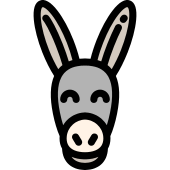

# 

# Survey-Donkey

Survey Donkey is a simple survey listing application

[](https://app.netlify.com/sites/laughing-mayer-d1330f/deploys)

## Try it out

[Demo](https://surveydonkey.netlify.com)

## Quickstart

### Install dependencies

- Install dependencies:

```bash
$ npm i
```

- Create .env file based on [.env.sample](./.env.sample)

### Start app

- Start in development:

```bash
$ npm run dev
```

- Start in production:

```bash
$ npm run build
```

```bash
$ npm start
```
